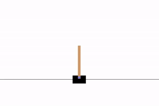

# keras-gym
*Plug-n-Play Reinforcement Learning in Python*




Create simple, reproducible RL solutions with Keras function approximators.


## Documentation

For the full documentation, go to
[keras-gym.readthedocs.io](https://keras-gym.readthedocs.io/)


## Install

Install using pip:

```
$ pip install -U keras-gym
```
or install from a fresh clone
```
$ git clone https://github.com/KristianHolsheimer/keras-gym.git
$ pip install -e ./keras-gym
```

## Examples

To get started, check out the [notebooks](notebooks/) for examples. These are
also included in the documentation:

* https://keras-gym.readthedocs.io/notebooks/

Alternatively, you could also watch this short tutorial video:

[](https://www.youtube.com/watch?v=MYPchUxPdyQ)

Here's one of the examples from the notebooks, in which we solve the
`CartPole-v0` environment with the SARSA algorithm, using a simple
linear function approximator for our Q-function:


```python
import gym
import keras_gym as km
from tensorflow import keras


# the cart-pole MDP
env = gym.make('CartPole-v0')


class Linear(km.FunctionApproximator):
    """ linear function approximator """
    def body(self, X, variable_scope):
        # body is trivial, only flatten and then pass to head (one dense layer)
        return keras.layers.Flatten()(X)


# value function and its derived policy
func = Linear(env, lr=0.001)
q = km.QTypeI(func, update_strategy='sarsa')
policy = km.EpsilonGreedy(q)

# static parameters
num_episodes = 200
num_steps = env.spec.max_episode_steps

# used for early stopping
num_consecutive_successes = 0


# train
for ep in range(num_episodes):
    s = env.reset()
    policy.epsilon = 0.1 if ep < 10 else 0.01

    for t in range(num_steps):
        a = policy(s)
        s_next, r, done, info = env.step(a)

        q.update(s, a, r, done)

        if done:
            if t == num_steps - 1:
                num_consecutive_successes += 1
                print("num_consecutive_successes: {}"
                      .format(num_consecutive_successes))
            else:
                num_consecutive_successes = 0
                print("failed after {} steps".format(t))
            break

        s = s_next

    if num_consecutive_successes == 10:
        break


# run env one more time to render
km.render_episode(env, policy, step_delay_ms=25)

```

The last episode is rendered, which shows something like the gif at the top of
this page.

